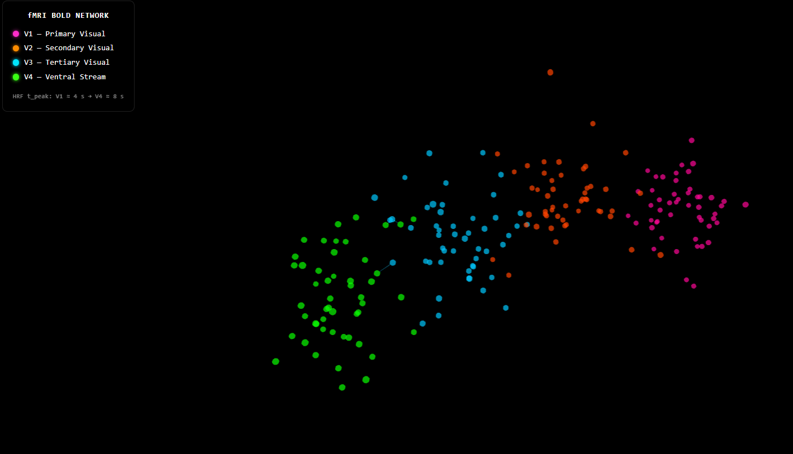

# Brain Network Visualizer

A web-based 3D brain functional connectivity visualization pipeline for fMRI-derived brain network data.

## Results



_200 voxels across visual cortex regions V1–V4, colour-coded by region. FDEB-bundled edges pulse with HRF-derived $t_{peak}$ animations rendered entirely on the GPU._

## Overview

This project addresses the visual clutter problem that arises when rendering large-scale fMRI-derived brain networks in 3D space. Rather than simply mapping medical data, it proposes a graphics-optimized pipeline that compresses high-dimensional 4D fMRI data using algorithms such as **Force-Directed Edge Bundling (FDEB)** and **spatiotemporal wavefronts**, enabling intuitive, real-time visualization at 60 fps in a web browser.

## Features

- **FDEB-based edge bundling** — bundles tangled voxel-wise connectivity edges into neural-fiber-like structures using hierarchical coarse-to-fine physics simulation, with HRF-driven pulsing animations via custom GLSL shaders
- **Spatiotemporal hemodynamic wavefront** — maps hemodynamic arrival time ($t_{peak}$) across the visual hierarchy (V1 → V4) as ripple/iso-contour overlays on a 3D brain mesh
- **7D latent parameter flow** — visualizes HRF fitting parameters reduced via UMAP/t-SNE as particle flow trajectories in 3D space
- **Backend–Frontend decoupled architecture** — heavy computation (HRF fitting, FDEB physics) runs offline in Python; only pre-computed spline control points and per-frame parameters are passed to the browser via JSON

## Tech Stack

| Layer    | Technologies                                      |
| -------- | ------------------------------------------------- |
| Backend  | Python · `scipy` · `numpy` · `networkx`           |
| Bridge   | JSON                                              |
| Frontend | React · React Three Fiber · Three.js · WebGL/GLSL |
| Bundler  | Vite                                              |

## Project Structure

```
.
├── prd.md                  # Product Requirements Document
├── generate_fdeb.py        # Python script: offline FDEB computation
├── network_data.json       # Pre-computed network data (root-level copy)
├── BrainNetworkViewer.jsx  # Standalone viewer component (prototype)
└── brain-viewer/           # Main Vite + React application
    ├── index.html
    ├── package.json
    ├── vite.config.js
    ├── public/
    │   └── network_data.json   # Network data served to the browser
    └── src/
        ├── main.jsx
        ├── App.jsx
        └── BrainNetworkViewer.jsx  # Core 3D visualization component
```

## Getting Started

### Prerequisites

- Node.js ≥ 18
- Python ≥ 3.9 with `numpy` and `scipy` installed

```bash
pip install numpy scipy
```

### 1. Generate network data (offline)

```bash
python generate_fdeb.py
```

This performs hierarchical FDEB physics simulation (P = 2 → 4 → 8 segments) and writes the resulting spline control points and animation parameters to `network_data.json`.

### 2. Copy data to the frontend

**macOS / Linux**

```bash
cp network_data.json brain-viewer/public/network_data.json
```

**Windows (PowerShell)**

```powershell
Copy-Item network_data.json brain-viewer\public\network_data.json
```

### 3. Install dependencies and run the dev server

```bash
cd brain-viewer
npm install
npm run dev
```

Open `http://localhost:5173` in your browser.

## FDEB Algorithm Details

The Python backend implements **Force-Directed Edge Bundling** (Holten & van Wijk, EuroVis 2009) with the following key design decisions.

### Compatibility score $C = C_a \cdot C_s \cdot C_p$

| Component      | Formula                                        | Notes                                                       |
| -------------- | ---------------------------------------------- | ----------------------------------------------------------- |
| Angle $C_a$    | $\lvert\cos\theta\rvert$                       | Anti-parallel edges score 1 (bundled after index mirroring) |
| Scale $C_s$    | $\dfrac{2 \cdot l_i \cdot l_j}{l_i^2 + l_j^2}$ | Holten eq. (5); equals 1 for equal-length edges             |
| Position $C_p$ | $\dfrac{\bar{l}}{\bar{l} + d_{mid}}$           | Decays with midpoint distance                               |

Compatibility is **pre-computed once** (`compat_adj`) before the simulation loop — an O(E²) cost that is amortised across all iterations.

### Numerical stability

A raw force sum over many compatible neighbours causes unbounded coordinate growth (observed: values up to 10⁴⁸ in early versions). Two safeguards are applied each iteration:

1. **Weighted average** — electrostatic attraction is divided by the total compatibility weight $\Sigma_j C_{ij}$, so the force magnitude is independent of neighbourhood size.
2. **Step clamping** — the combined displacement vector is capped at `MAX_STEP = 0.5` world units per iteration, preventing overshooting.

### Anti-parallel edge handling

When two edges point in opposite directions ($\vec{v}_i \cdot \vec{v}_j < 0$), control point $p_i$ at index `pi` is attracted to the **mirrored** index `P - pi` on edge $j$. This avoids the tangling artefact that occurs when A→B and B→A connections are bundled using the same index.

### Hierarchical subdivision (Coarse-to-Fine)

Rather than starting with a fixed P = 8, the simulation progresses through three levels:

```
P = 2  (1 interior point)  →  40 iterations
         ↓  subdivide (insert midpoints)
P = 4  (3 interior points) →  40 iterations
         ↓  subdivide
P = 8  (7 interior points) →  40 iterations
```

Starting coarse avoids local minima; finer levels then refine the bundle shape.

## Renderer Details (BrainNetworkViewer.jsx)

Edge animation is handled entirely on the GPU. Each edge's `t_peak_src` and `t_peak_tgt` values are passed as **vertex attributes** and interpolated in the vertex shader using the UV coordinate along the spline. The fragment shader computes a Gaussian HRF pulse at runtime:

```glsl
float t_peak = mix(a_tPeakSrc, a_tPeakTgt, vUv);
float dt = u_time - t_peak;
float pulse = exp(-dt * dt / (2.0 * sigma * sigma));
```

This produces a travelling activation wavefront across V1 → V4 at 60 fps with zero per-frame CPU cost.

## Known Limitations & Future Work

| Area                 | Current state                   | Improvement path                                                                                              |
| -------------------- | ------------------------------- | ------------------------------------------------------------------------------------------------------------- |
| Scale                | Mock data: 200 nodes, 450 edges | Real whole-brain fMRI: ~400 nodes, ~20 000 edges; O(E²) compat precompute becomes a bottleneck                |
| Spatial partitioning | None                            | Replace O(E²) loop with `scipy.spatial.KDTree` neighbour search for edges within radius R                     |
| Real fMRI input      | KNN-generated mock edges        | Use Pearson correlation matrix with threshold (e.g. r > 0.5); show negative correlations in a separate colour |
| Dynamic connectivity | Static $t_{peak}$ values        | Extend GLSL shader to animate HRF parameters over time (Dynamic Functional Connectivity)                      |

## Research Context

Brain functional connectivity is analyzed from fMRI BOLD signals using Multiscale Entropy (MSE) and ANCOVA to study aging and neurological disease. This visualization pipeline makes those findings accessible and explorable directly in the browser, without requiring specialized software installation.

## License

MIT
